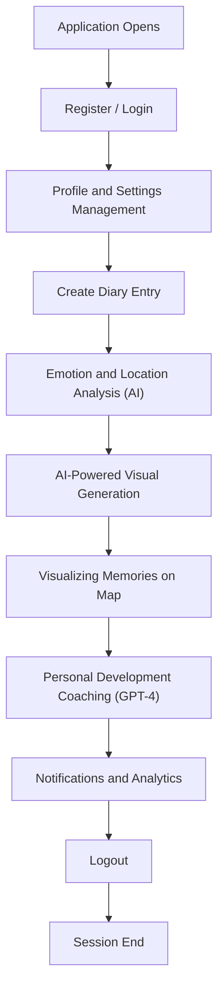

# User Flow

The user uses the application with the following detailed steps:

1. **Registration / Login:**
   - User creates a new account with email and password or logs in with existing account.
   - After successful login, JWT-based session is started and user is redirected to main screen.

2. **Profile and Settings Management:**
   - User can update profile information (name, photo, email, etc.).
   - Can manage notification preferences and privacy settings.

3. **Creating Diary Entry:**
   - User writes their diary in a multi-line text field.
   - When entry is saved, date and time are automatically added.
   - User can optionally add visuals or manage existing visuals.

4. **Emotion and Location Analysis:**
   - The entered diary text is processed in the background with HuggingFace DistilBERT model for emotion analysis.
   - Place/location names are automatically extracted from text with spaCy or HuggingFace NER models.
   - Extracted places are converted to coordinates with OpenStreetMap API.

5. **AI-Powered Visual Generation:**
   - Original visuals suitable for diary entries are automatically generated with Stable Diffusion model.
   - User can save generated visuals to gallery or delete them.

6. **Visualizing Memories on Map:**
   - Extracted places are marked on OpenStreetMap-based interactive map with Leaflet.js.
   - When markers on the map are clicked, details and visuals of related diary entries are shown.

7. **Personal Development Coaching:**
   - GPT-4 based reflective questions and personal development suggestions are presented to the user.
   - User can respond to these questions and track their own development.

8. **Notifications and Analytics:**
   - Motivational and reminder push notifications are sent with Firebase Cloud Messaging.
   - User can track metrics like diary writing habits, emotion changes, and visited places with in-app analytics.

9. **Logout:**
   - User can securely end the session.

---

Below is the diagram of the detailed user flow:

---

## User Roles

- **Standard User:** Creates their own diaries, uses analysis and map features, benefits from coaching and notifications.
- **Admin (Developer/Operator):** System management, user support, and moderation operations (this role may be optional in MVP).

---

## API Endpoint Examples

Below are example API endpoints corresponding to the basic steps in the user flow:

| Step | Method | Endpoint | Description |
|------|--------|----------|-------------|
| Registration | POST | /api/v1/auth/register | New user registration |
| Login | POST | /api/v1/auth/login | User login |
| Profile Info | GET | /api/v1/users/me | Logged-in user information |
| Diary Entry | POST | /api/v1/entries | Create new diary entry |
| Diary Listing | GET | /api/v1/entries | List user's diary entries |
| Diary Detail | GET | /api/v1/entries/{id} | Details of specific diary entry |
| Notification | POST | /api/v1/notifications | Notification creation and management |

---

## Non-Functional Requirements (Reference)

- Throughout the user flow, security (JWT, HTTPS), performance (fast response), accessibility, and scalability requirements are observed. For details, see the tech-stack.md file. 