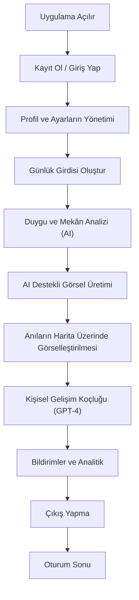

# Kullanıcı Akışı (User Flow)

Kullanıcı uygulamayı aşağıdaki detaylı adımlarla kullanır:

1. **Kayıt Olma / Giriş Yapma:**
   - Kullanıcı, e-posta ve şifre ile yeni hesap oluşturur veya mevcut hesabıyla giriş yapar.
   - Başarılı giriş sonrası JWT tabanlı oturum başlatılır ve kullanıcı ana ekrana yönlendirilir.

2. **Profil ve Ayarların Yönetimi:**
   - Kullanıcı, profil bilgilerini (isim, fotoğraf, e-posta vb.) güncelleyebilir.
   - Bildirim tercihleri ve gizlilik ayarlarını yönetebilir.

3. **Günlük Girdisi Oluşturma:**
   - Kullanıcı, çok satırlı metin alanına günlüğünü yazar.
   - Girdi kaydedildiğinde, tarih ve saat otomatik olarak eklenir.
   - Kullanıcı, isteğe bağlı olarak görsel ekleyebilir veya mevcut görselleri yönetebilir.

4. **Duygu ve Mekân Analizi:**
   - Girilen günlük metni, arka planda HuggingFace DistilBERT modeliyle duygu analizi için işlenir.
   - spaCy veya HuggingFace NER modelleriyle metinden yer/mekân isimleri otomatik olarak çıkarılır.
   - Çıkarılan yerler, OpenStreetMap API'si ile koordinatlara dönüştürülür.

5. **AI Destekli Görsel Üretimi:**
   - Günlük girdisine uygun özgün görseller, Stable Diffusion modeliyle otomatik olarak üretilir.
   - Kullanıcı, üretilen görselleri galeriye kaydedebilir veya silebilir.

6. **Harita Üzerinde Anıların Görselleştirilmesi:**
   - Çıkarılan mekânlar, Leaflet.js ile OpenStreetMap tabanlı interaktif harita üzerinde işaretlenir.
   - Harita üzerindeki işaretçilere tıklandığında, ilgili günlük girdisinin detayları ve görselleri gösterilir.

7. **Kişisel Gelişim Koçluğu:**
   - Kullanıcıya, GPT-4 tabanlı reflektif sorular ve kişisel gelişim önerileri sunulur.
   - Kullanıcı, bu sorulara yanıt vererek kendi gelişimini takip edebilir.

8. **Bildirimler ve Analitik:**
   - Firebase Cloud Messaging ile motivasyonel ve hatırlatıcı push bildirimler gönderilir.
   - Kullanıcı, uygulama içi analitiklerle günlük yazma alışkanlığı, duygu değişimleri ve ziyaret edilen yerler gibi metrikleri takip edebilir.

9. **Çıkış Yapma:**
   - Kullanıcı, güvenli şekilde oturumu sonlandırabilir.

---

Aşağıda detaylandırılmış kullanıcı akışının diyagramı yer almaktadır:

---

## Kullanıcı Rolleri

- **Standart Kullanıcı:** Kendi günlüklerini oluşturur, analiz ve harita özelliklerini kullanır, koçluk ve bildirimlerden faydalanır.
- **Admin (Geliştirici/Operatör):** Sistem yönetimi, kullanıcı desteği ve moderasyon işlemleri (bu rol MVP'de opsiyonel olabilir).

---

## API Endpoint Örnekleri

Aşağıda, kullanıcı akışındaki temel adımlara karşılık gelen örnek API uçları verilmiştir:

| Adım | Metot | Endpoint | Açıklama |
|------|-------|----------|----------|
| Kayıt Olma | POST | /api/v1/auth/register | Yeni kullanıcı kaydı |
| Giriş Yapma | POST | /api/v1/auth/login | Kullanıcı girişi |
| Profil Bilgisi | GET | /api/v1/users/me | Oturum açan kullanıcının bilgileri |
| Günlük Girdisi | POST | /api/v1/entries | Yeni günlük girdisi oluşturma |
| Günlük Listeleme | GET | /api/v1/entries | Kullanıcının günlüklerini listeleme |
| Günlük Detayı | GET | /api/v1/entries/{id} | Belirli günlük girdisinin detayları |
| Bildirim | POST | /api/v1/notifications | Bildirim oluşturma ve yönetimi |

---

## İşlevsel Olmayan Gereksinimler (Referans)

- Tüm kullanıcı akışı boyunca güvenlik (JWT, HTTPS), performans (hızlı yanıt), erişilebilirlik ve ölçeklenebilirlik gereksinimleri gözetilir. Detaylar için tech-stack.md dosyasına bakınız. 